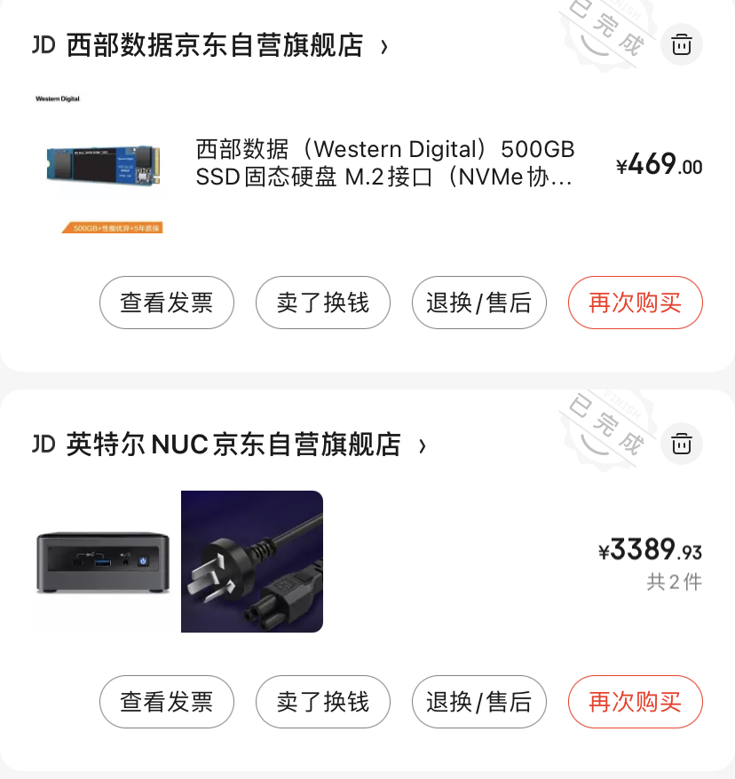
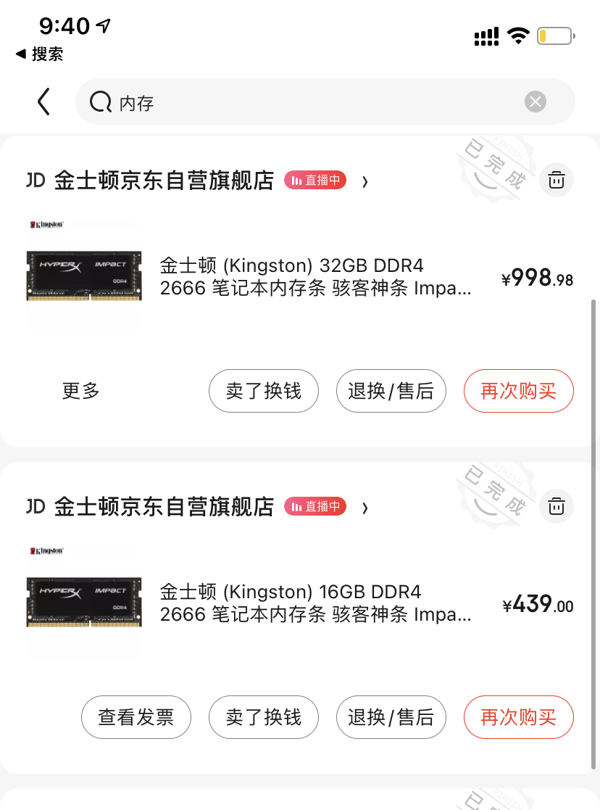

# 01 Homelab v2 \(2021\)

### 前言

经过了半年时间的摸索，我终于在2021年完成我的homelab v2的改造。前期花了5000多元人民币，加上每月不到200元的电费，目前这套lab完全能够胜任我日常的工作，学习，娱乐的需求（至少到现在为止）。

### 我对homelab的需求

先说一下我对homelab的需求，如果你也有相同的想法，那么这个文章可以作为你选型的参考。

首先我的homelab环境，我不会运行特别重要的服务，它就是我的it实验中心，能够跑Linux，Windows等常规的系统就行，最好是那种在硬件之上能够做虚拟化的。

因为不会跑太CPU密集型任务，所以CPU的内核数和线程数差不多就行，反正虚拟方案很多都是可以设置CPU share。

但是内存是必须得大，最好32GB起步，比如我需要启动一个虚拟机然后安装Kubernetes，随便跑个大型服务，比如说Elastic search服务，或者ELK套件，内存就直接爆掉了。内存是越大越好。

满足以上硬件条件后，我首选[ESXi](https://www.vmware.com/products/esxi-and-esx.html) \(7.0\)系统作为我的虚拟解决方案。也有其他的虚拟解决方案\([https://alternativeto.net/software/vmware-esxi/](https://alternativeto.net/software/vmware-esxi/)\)，但是目前我对这个最为熟悉，所以首选ESXi。

以上就是我对homelab环境的需求。

### 寻找我的homelab

看过我之前视频的同学应该能知道，我几乎就是把我的一个mac mini当作我homelab环境的。但是最近因为要玩一下Kubernetes，小mac mini的8G内存实在是顶不住了。

我看过很多的homelab解决方案，有的推荐买咸鱼二手服务器，但是我自己就是做服务器管理的，知道那个风扇和功耗放自己家跑肯定是不适合的。

我自己也有树莓派4b 2G内存的型号，arm架构，内存小等缺点这个直接被我放弃作为homelab的需求，而且性价比也不高。

直到有一天，我一个朋友买了一个[nuc10](https://www.intel.com/content/www/us/en/products/sku/188811/intel-nuc-10-performance-kit-nuc10i7fnh/specifications.html)，我再去了解一下，然后我就发现了新大陆。

于是我果断的在去年下半年的时候买了当时最新的nuc10，最近我也有看到它出了nuc11版本。但是这两天我去京东上查我的nuc10，现在还涨价了，也是没谁了。

这个巴掌大的盒子就是我理想中的homelab方案。

因为，功耗很小，整体TDP（Thermal Design Power）热设计功耗25W，最大支持内存64GB，i7-10710U处理器，是一颗15W的CPU，有6核，共12线程。这样的硬件配置，完全可以跑虚拟化同时开多个虚拟机了。\(详细参数见：[https://www.intel.com/content/www/us/en/products/sku/188811/intel-nuc-10-performance-kit-nuc10i7fnh/specifications.html](https://www.intel.com/content/www/us/en/products/sku/188811/intel-nuc-10-performance-kit-nuc10i7fnh/specifications.html)）

OK，让我带大家体验一下我的homelab v2吧。

### 兵马未动,粮草先行

先算钱，看一下我这套方案的成本是多少。买nuc10本身3399元，nuc默认不包含硬盘和内存。一共48GB内存。

| 商品 | 单价 | 数量 | 总价 |
| :--- | :--- | :--- | :--- |
| NUC10 | 3389.93 | 1 | 3389.93 |
| SSD | 469 | 1 | 469 |
| 32GB 内存 | 998 | 1 | 998 |
| 16GB 内存 | 439 | 1 | 439 |
| / | / | **汇总：** | **5295.93** |

电费的成本也容易计算出来，我使用的是小米智能插座增强版来计算nuc10以及树莓派的总电量。进入智能插座首页可以看到实时的功率，目前差不多20多W。我们看一下统计。平均每天0.5度电，我们按月看，平均每月大概15度电。按照上海市电费的2021年标准，我们取最高档的费用，0.917元，这样算下来一个月差不多15块钱。一年下来不会超过200块钱。

### 安装esxi系统

大家可以去百度或者Google去寻找适合你自己硬件的ESXi安装方案。

### NUC10上的ESXi系统

目前我用的ESXi是7.0版本，在NUC10上支持显卡直通到虚拟机，唯一遗憾的是没有办法把支持Wi-Fi6的无线网卡利用起来，能够成功直通到我的win10中，但是设备状态永远都是disable状态，目前Wi-Fi网卡完全使用不了。我查过Google，说是这款网卡ESXi直通不起作用，我也没有继续找hack的方案，就这样吧。使用ESXi默认的交换机也不差多少，至少我局域网内串流4k电影没有问题。

### Demo创建ubuntu，Windows虚拟机

ubuntu虚拟机：

Windows10虚拟机：

显卡直通给Windows10：

### 总结

总结一下。我的这个NUC10 + ESXi，目前能做的事情如下：

1. 虚拟化win10，直通显卡，然后安装Plex服务器，挂载我树莓派做的nas，作为家庭流媒体中心
2. 虚拟化ubuntu系统，安装microk8s，然后再上面跑我的k8s-bundle应用

