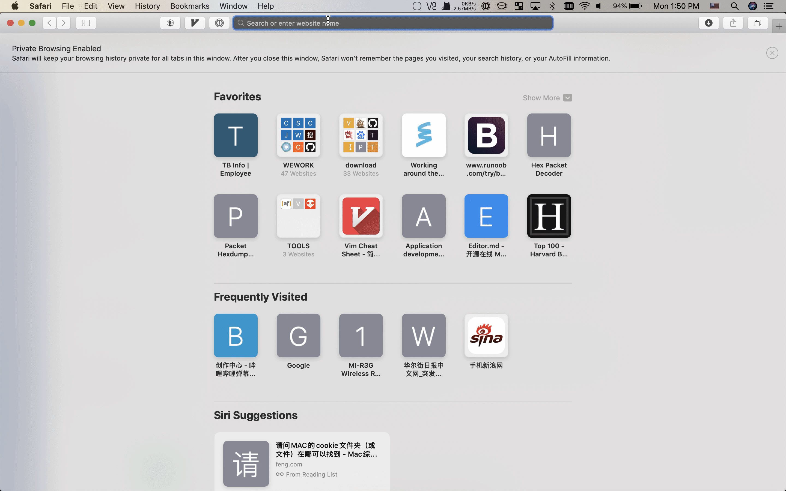

# iTerm2 + Oh My Zsh


In this tutorial, I'm going to show you how I used the "iTerm2 + Oh My Zsh" combined with macos features \(iCloud, Keychain Access\) to make sure we can have a handy/updated/secure command line tool across all my macos devices \(I have a macbook pro in office, macmini in my home\).

## Steps

### iTerm2 + Oh My Zsh overview & installation \[ONLY FOR THE FIRST TIME\]

Please follow this gist [https://gist.github.com/kevin-smets/8568070](https://gist.github.com/kevin-smets/8568070) to have an overview on iTerm2 & Oh My Zsh, and then install the iTerm2 & Oh My Zsh on your macos ONLY FOR THE FIRST TIME.

### Make the configuration iCloud-syncable

* Setup iTerm2 to use the preferences from iCloud storage
* Reorg `~/.profile` and `~/.zshrc` 

### Security Security Security

Always consider to have a more secure way to set your sensitive environment in your command line.

* Keychain Access
* `security` command
* TouchID
* [https://apple.stackexchange.com/questions/311334/replace-password-prompt-with-touch-id-to-read-keychain-password](https://apple.stackexchange.com/questions/311334/replace-password-prompt-with-touch-id-to-read-keychain-password)

### Notification with iTerm "triggers"



It looks like this


### Autojump

[autojump](https://github.com/wting/autojump)

A cd command that learns - easily navigate directories from the command line


### zsh-completions

[zsh-completions](https://github.com/zsh-users/zsh-completions)

Additional completion definitions for Zsh.


### Other recommended software

```bash
# Just in case of GFW
export all_proxy=127.0.0.1:7890

xcode-select --install
brew install gcc
brew install libuv
brew install zsh zsh-completions autojump zsh-syntax-highlighting

brew install wireshark --with-qt
brew cask install wireshark
brew install postgresql
brew tap theory/sqitch
brew install sqitch_pg
brew install sqitch --with-postgres-support
brew install wget
brew cask install visual-studio-code
brew cask install iterm2
brew cask install appcleaner
brew install caskroom/cask/brew-cask
# brew tap caskroom/versions
brew cask install sublime-text
brew tap homebrew/cask-fonts
brew cask install font-inconsolata font-menlo-for-powerline font-meslo-for-powerline
#brew install terraform
brew install tfenv
tfenv install 0.12.7
brew install packer
brew install ansible
brew cask install virtualbox
brew cask install vagrant
brew cask install vagrant-manager
vagrant plugin install vagrant-vbguest
vagrant vbguest

brew cask install typora
brew cask install github
brew install autossh
brew install jq
brew install gnu-sed
brew install mysql
brew install pre-commit
brew install certbot
brew install tig

brew cask install dash
brew cask install shortcat
brew cask install google-cloud-sdk
brew cask install docker
brew cask install google-chrome
brew cask install firefox

brew cask install qlcolorcode qlstephen qlmarkdown quicklook-json webpquicklook suspicious-package quicklookase qlvideo

brew install sonar-scanner

# web debugging app
brew cask install charles
brew cask install chromedriver
brew install telnet

# Graph
brew install graphviz

# Lock Mac without turning off the screen
brew cask install keepingyouawake

brew install grpcurl

# Converter
brew cask install handbrake

# CNCF
brew install kubernetes-helm
https://docs.docker.com/docker-for-mac/

# For record
brew cask install keycastr
```

