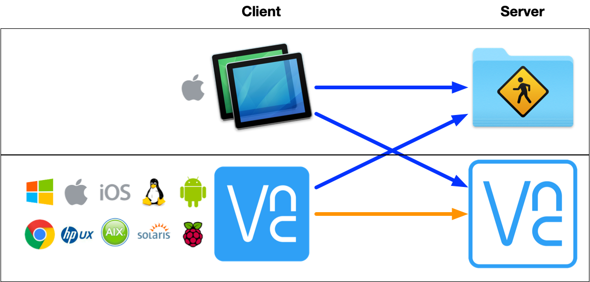

# Remote Desktop on Mac

I’m going to share how to connect to your Mac from both your home network and the Internet.

There are a lot of [remote desktop software alternatives](https://alternativeto.net/software/realvnc/?__cf_chl_jschl_tk__=160b0af995d865b48328ec334ffd4f8c100e5795-1583126961-0-AcXSvxR80AXrVLrS9AO1LkrkUGdKgBzEZF6ITYW-C5DZBVe5ZFPxa9ta0RbA3VCWCYIU6ham1qXhwItvYBK4knGolSSI7urIqgyXROGL5f1jI5NaaZ7KwYRFiBK-YjjT1I3SBff9Bi5jl8Wh43dUdO5uD-aiTP4wXqay0Gnv3roHeWGiu1KIkW7HM1R5UFZbc4DZeYBafPmvqraGr-ak5WBcQMQL_3R1AiyZroUzPAPozW0F0TKjR2FbzKxU-VY8iQEYxhTSOidmFHZHPY13bwuEcg1Oi45FHzIty6mjJrDefAidTK847CBoMOrnlfLt5M1RFPKk9CEXNbCzrftn2ceOswaerHSpuc96HkqyPOUr), I'm not going to test them all.

I will only give TWO SOLUTIONS on Macos platform based on below principle:

* Free software
* Easy to use

## macos "Screen Sharing"

#### Setup

Go to "System Preferences" -&gt; "Sharing"

Select "Screen Sharing"

That's it

You will get the connection information once the "Screen Sharing" is On.

> Other users can access your computer’s screen at vnc://&lt;you\_mac\_ip&gt;/ or by looking for “&lt;your Mac's Name&gt;” in the Finder sidebar.

#### Connection

Now we're ready to connect it from another device under the same network, let's use another mac to connect to the previous desktop.

* Open it with Safari

Just copy the address of "vnc://&lt;the\_remote\_mac\_ip&gt;/" in your safari and press enter, it will open the associated vnc client software to connect to the remote mac, the default VNC client should be "Screen Sharing.app"

* Open it in Finder sidebar

Go to "Finder.app", find the "Network" sidebar, you will see the name of the remote mac, just click on "Share Screen..." button

## Connect to your Desktop from the Internet

Now we can connect to our mac from another mac in the same network. What if we wanted to connect to our mac from Internet? Let's check one solution, [Real VNC](https://www.realvnc.com/en/).

The Real VNC is a third party software for connecting to your mac from anywhere, it's free for non-commercial use.

#### Register Real VNC account

Registry with your email address with [this link](https://manage.realvnc.com/en/?_ga=2.61572524.1827881223.1583126355-1427651239.1577240029)

#### Install "VNC server" on your mac

1. Download VNC Server from [this link](https://www.realvnc.com/en/connect/download/vnc/)
2. Install it
3. Enable it and login with your own real vnc account

#### Install "VNC viewer" on any other platform \[Let's use IOS for instance\]

1. Download VNC Viewer from app store
2. Login with your own real vnc account
3. Select your VNC in the list

## Ref







