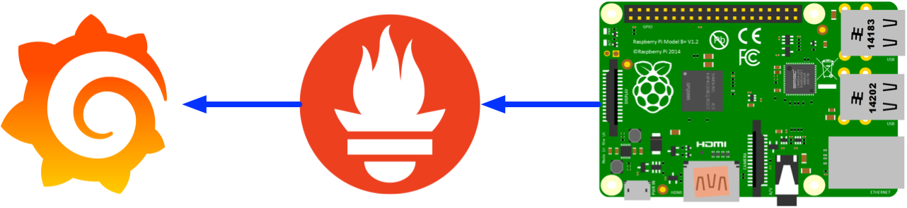

# Collect your Pi's metrics to Prometheus

Let's collect your Pi's metrics to Prometheus, and use grafana to do the dashboard.

## Home network topology

## What do I have

- Prometheus/Grafana
- Raspberrypi 4B
- Port forwarding working on miwifi3g

## Steps

TODO
