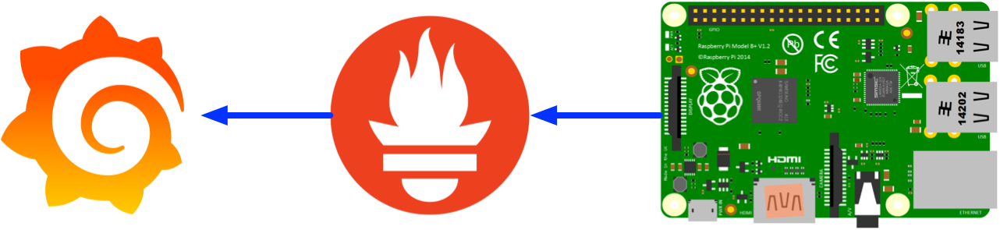

# 03 collect metrics

Let's collect your Pi's metrics to Prometheus, and use grafana to show the dashboard.

## Home network topology



## What do I have

* Prometheus/Grafana
* Raspberrypi 4B
* Port forwarding working on miwifi3g

## Steps

#### Install node-exporter on pi

* Download the node-exporter from [prometheus official site](https://prometheus.io/download/#node_exporter) \(Let's use Version **0.18.1** as the example\)

```text
cd /home/pi
wget https://github.com/prometheus/node_exporter/releases/download/v0.18.1/node_exporter-0.18.1.linux-armv7.tar.gz
tar xzvf node_exporter-0.18.1.linux-armv7.tar.gz
cd node_exporter-0.18.1.linux-armv7/
```

* Test on node-exporter

```text
./node_exporter
```


The default node\_exporter for pi is listening on :9100, you can also see the address in the end of the command log.


You shall be able to open the link with the node level metrics: [http://192.168.123.15:9100](http://192.168.123.15:9100)/metrics

#### Run the node-exporter on startup


There's a lot of ways to make a service running on startup, I'm just gong to give a simply way.


* Add the startup command to `/etc/rc.local`

```text
sudo -u pi nohup /home/pi/node_exporter-0.18.1.linux-armv7/node_exporter&
```

Reboot the Pi and the process should be there.

#### Prometheus/Grafana Configuration for the new node\_exporter \(Skip\)

#### Do the same for the deluge metrics exporter

Recommend this solution: [https://github.com/tobbez/deluge\_exporter](https://github.com/tobbez/deluge_exporter)


