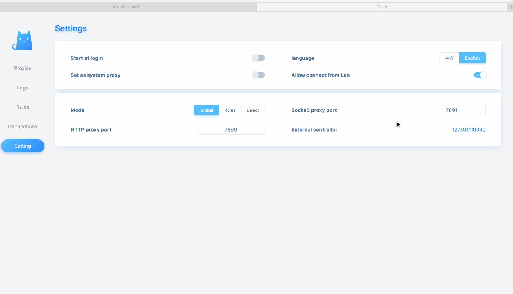

# Install Clash & Dashboard on Raspberry Pi

## Download software from [https://github.com/Dreamacro/clash/releases](https://github.com/Dreamacro/clash/releases)


Please mind that the raspberry pi 4B cpu architecture is "armv7"


```
export CLASH_VERSION=v0.18.0
cd /home/pi
wget https://github.com/Dreamacro/clash/releases/download/${CLASH_VERSION}/clash-linux-armv7-${CLASH_VERSION}.gz
tar xzvf clash-linux-armv7-${CLASH_VERSION}.gz
cd clash/
```

## Write the config

The clash will use ~/.config/clash as its default config source, for the configuration, please refer to [https://github.com/Dreamacro/clash](https://github.com/Dreamacro/clash)


```bash
vim ~/.config/clash/config.yaml
sudo /home/pi/clash/clash-linux-armv7 -d /home/pi/.config/clash/

```


## Make it start on system boot

Append below line into "/etc/rc.local"

```text
nohup /home/pi/clash/clash-linux-armv7 -d /home/pi/.config/clash >> /tmp/output.log 2>&1  </dev/null
```

## Dashboard



```bash
docker run -d --restart always -p 8080:80 hitian/clash-dashboard
# --restart always, make the docker start on system boot
# -d, put into background
# -p, mapping host 8080 to container's 80
```


You will meet "standard\_init\_linux.go:211: exec user process caused "exec format error", the solution can be found in [https://github.com/edgedb/edgedb-docker/issues/2](https://github.com/edgedb/edgedb-docker/issues/2)


```bash
# On Pi, get the Dockerfile from https://hub.docker.com/r/hitian/clash-dashboard/dockerfile
docker build -t clash-dashboard .
```

### Usage



