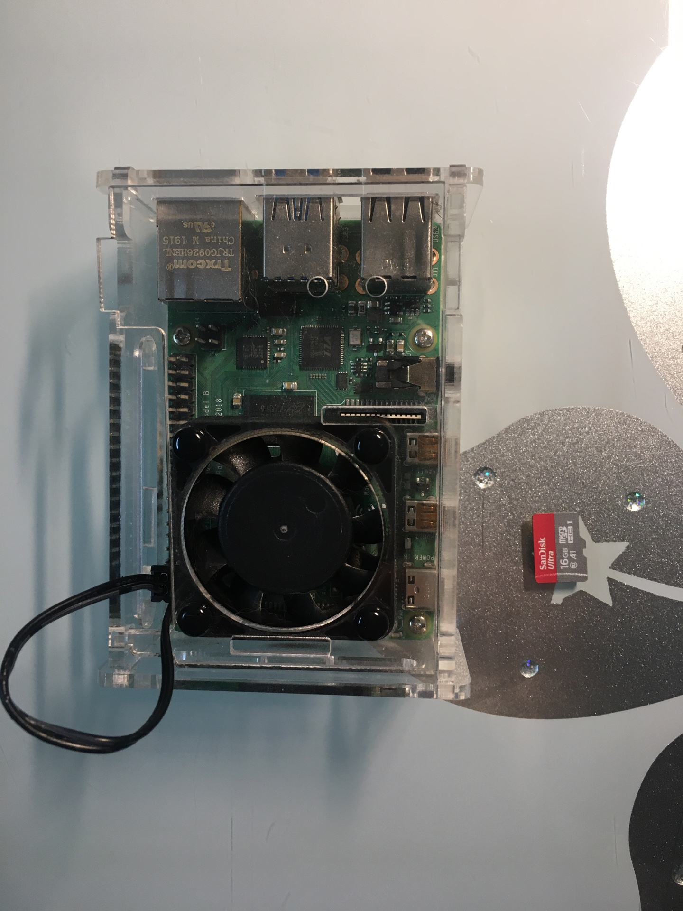
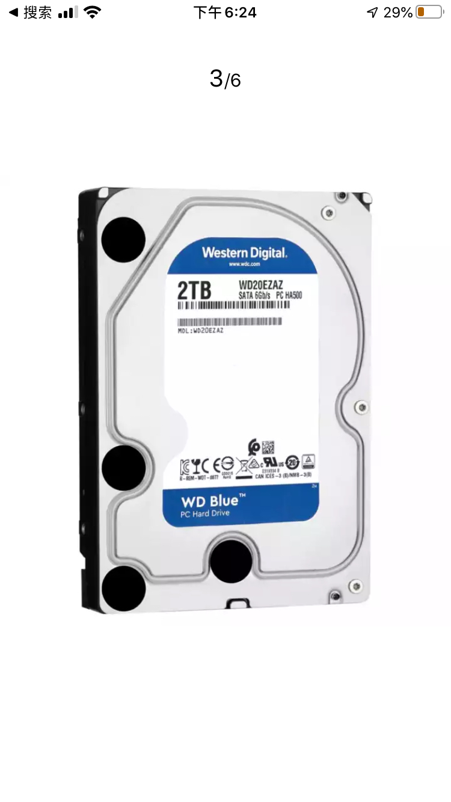

# 树莓派下载机

## raspberrypi-bittorrent-box

Turn a Raspberry Pi into an Always-On BitTorrent Box, more info please refer to [How to Turn a Raspberry Pi into an Always-On BitTorrent Box](https://www.howtogeek.com/142044/how-to-turn-a-raspberry-pi-into-an-always-on-bittorrent-box/)

### Bilibili Video List

* [树莓派折腾记01：树莓派下载机](https://www.bilibili.com/video/av90710813/)
* [树莓派折腾记02：为电视提供4K串流服务](https://www.bilibili.com/video/av90862342/)
  * README:: [Setup home nas for 4k streaming home-nas](./home-nas/README.md)
* [树莓派折腾记03：公网访问树莓派的deluge服务](https://www.bilibili.com/video/av91123250/)
  * README:: [Expose your internal service to the Internet](./expose-service/README.md)

### What do I have

* Raspberrypi 4B with a 16GB TF card[Raspberry Pi 4](https://www.raspberrypi.org/products/raspberry-pi-4-model-b/)

* Harddisk \(2TB\) with 2 slot box

### Steps

#### Install OS into the Pi's TF card

[Set up your SD card](https://projects.raspberrypi.org/en/projects/raspberry-pi-setting-up/2)

NOOBS or balenaEtcher

#### Boot the OS and setup at the first time

[Finish the setup](https://projects.raspberrypi.org/en/projects/raspberry-pi-setting-up/5)

Recommended Setup:

* Enable SSH
* Enable VNC Server
* Insert harddrive

#### Install/Setup Deluge

[How to Turn a Raspberry Pi into an Always-On BitTorrent Box](https://www.howtogeek.com/142044/how-to-turn-a-raspberry-pi-into-an-always-on-bittorrent-box/)

Required:

* Step One: Install Deluge on Raspbian
* Option Two: Set Up Deluge for WebUI Access

Recommended:

* Step Two: Configure Your Proxy or VPN
* Step Three: Configure Your Download Location
* Install Browser Plugins \["DelugeSiphon", "Remote Deluge"\]
* Activate Deluge Plugins \["Auto Remove Plus"\]

### Ref

[Deluge](https://dev.deluge-torrent.org/)

