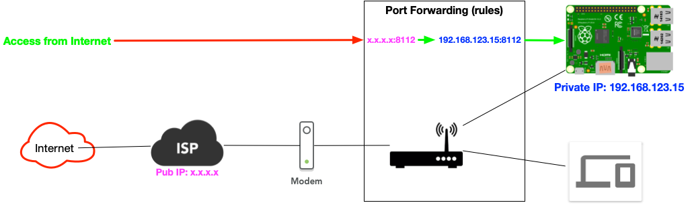

# Setup NAS for 4K streaming

## Home network topology

## What do I have

- Sony TV 9000f [4K support]
- Nvidia Shield TV (2018)
  - Gigabit Ethernet
  - HDMI 2.0b
- Raspberrypi 4B
- Cat 6 cable

## Objective

Setup the Raspberrypi as my home's NAS stroage, Shield TV will use it as its 4k streaming source.

## Steps

### Install SMB service into Raspberrypi OS

[Samba: Set up a Raspberry Pi as a File Server for your local network](https://magpi.raspberrypi.org/articles/samba-file-server)

- Install samba software
- Config samba software
- Find your Pi on the network [Test]

### Using SMB service as Nvidia Shield TV's 4k streaming source

- Mount SMB service in Kodi
- Test on 4K streaming

### Backup the Raspberrypi's OS

[Back up your Raspberry Pi: how to save and restore files](https://magpi.raspberrypi.org/articles/back-up-raspberry-pi)
